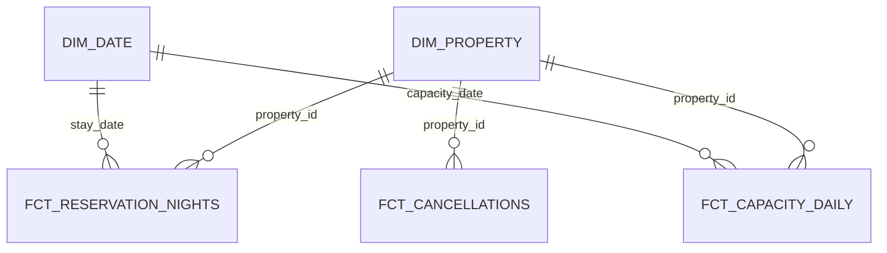

# Nova M Hotels & Residences — Project Overview

## Goal

This portfolio demonstrates Snowflake, dbt, dimensional modeling, testing,
and Tableau-ready revenue and occupancy analytics for a fictional ten-property
hotel group in Austria, Italy, and Slovenia.

## Model and business rules

`fct_reservation_nights` is at reservation × stay-date grain; Confirmed
reservations emit every stay night and No_Show reservations emit one retained
first-night row on check-in date. `fct_capacity_daily` is at property × room
type × date grain. `fct_cancellations` is at reservation grain. Capacity and
reservation facts remain separate to prevent fan-out.

Occupancy is Rooms Sold / Available Rooms, ADR is Room Revenue / Rooms Sold,
and RevPAR is Room Revenue / Available Rooms. A no-show first night counts as
one room sold under Nova M's explicit demo rule.

## Production considerations

Source freshness monitoring, incremental models, snapshots/SCD2, RBAC, and
job alerting are documented production enhancements. They are deliberately
out of scope for this static synthetic-data demo.
